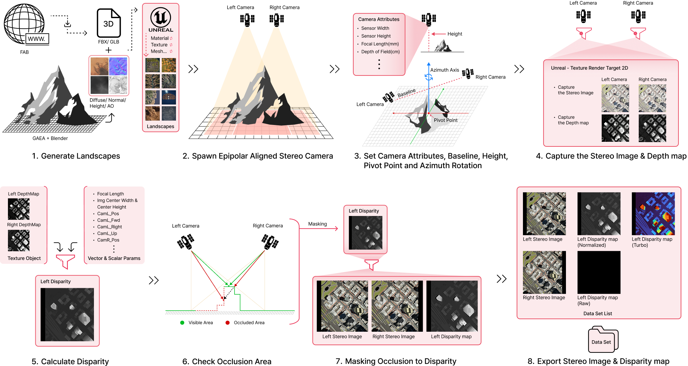
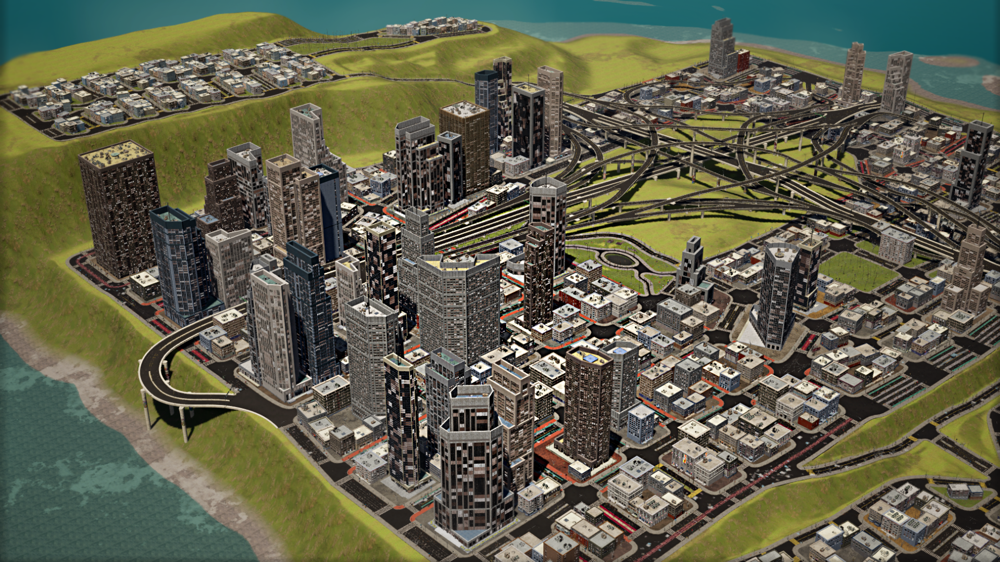
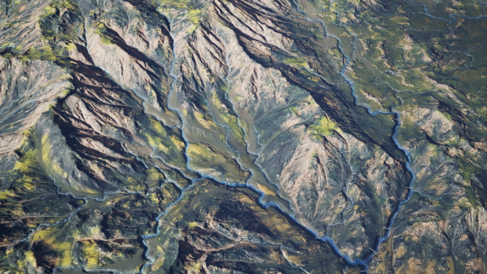
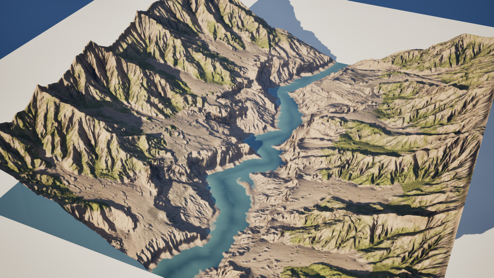
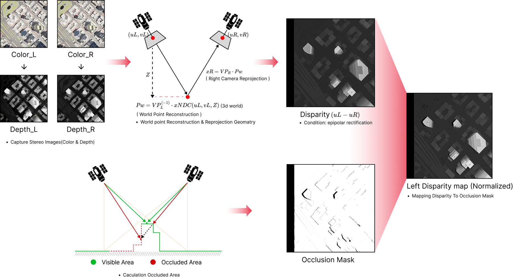

# SatUnreal: A High-Precision Synthetic Dataset for Satellite Stereo Matching via Unreal Engine

**[Project page](<POJECT_PAGE_LINK>)** | **[Paper](<PAPER_LINK>)** | **[Supplemental](<SUPPLEMENTAL_LINK>)**

**Han-Gyeol Kim** | **[Jaewan Park](<PROFILE_LINK>)** | **Junmin Park** | **[Darongsea Kwon](<PROFILE_LINK>)**

---

Demo code and captured disparity maps for the paper  
**“SatUnreal: A High-Precision Synthetic Dataset for Satellite Stereo Matching via Unreal Engine,”**  
presented at **“CVPR Workshop EarthVision 2026”**.

---

## Contents

- [Dataset Directory](#dataset-directory)
- [SatUnreal Dataset Generation Pipeline](#satunreal-dataset-generation-pipeline)
- [Configuration about the Dataset](#configuration-about-the-dataset)
- [Ground-Truth Disparity Map Generation](#ground-truth-disparity-map-generation)
- [License](#license)
- [Citation](#citation)

---

## Dataset Directory
### Directory Structure

> **⚠️ Important:**  Important Usage Notice-When using this dataset for training or research purposes with other AI models, the non-overlapping black regions (out-of-bounds areas) between the left and right stereo views must be cropped out. Using the raw images without cropping these invalid regions may lead to degraded model performance.

<p><b>Total:</b> <code>Disparity_All (63.29 GB)</code></p>

<table>
  <tr>
    <td valign="top" width="33%">
      <b>California</b><br>
      <sub>(22.5 GB)</sub><br><br>
      <small>
      ├── Disparity_Normalized<br>
      ├── Disparity_raw<br>
      │&nbsp;&nbsp;&nbsp;└── O0 ~ O7<br>
      ├── Color<br>
      │&nbsp;&nbsp;&nbsp;└── (O0_L, O0_R) ~ (O7_L, O7_R)<br>
      └── Json<br>
      &nbsp;&nbsp;&nbsp;&nbsp;└── O0 ~ O7
      </small>
    </td>
    <td valign="top" width="33%">
      <b>Canyon</b><br>
      <sub>(2.89 GB)</sub><br><br>
      <small>
      ├── Disparity_Normalized/<br>
      ├── Disparity_raw/<br>
      │&nbsp;&nbsp;&nbsp;└── O0<br>
      ├── Color<br>
      │&nbsp;&nbsp;&nbsp;└── (O0_L, O0_R)<br>
      └── Json<br>
      &nbsp;&nbsp;&nbsp;&nbsp;└── O0
      </small>
    </td>
    <td valign="top" width="33%">
      <b>Coast</b><br>
      <sub>(2.95 GB)</sub><br><br>
      <small>
      ├── Disparity_Normalized<br>
      ├── Disparity_raw<br>
      │&nbsp;&nbsp;&nbsp;└── O0/<br>
      ├── Color<br>
      │&nbsp;&nbsp;&nbsp;└── (O0_L, O0_R)<br>
      └── Json<br>
      &nbsp;&nbsp;&nbsp;&nbsp;└── O0
      </small>
    </td>
  </tr>

  <tr>
    <td valign="top" width="33%">
      <b>Desert</b><br>
      <sub>(2.5 GB)</sub><br><br>
      <small>
      ├── Disparity_Normalized<br>
      ├── Disparity_raw<br>
      │&nbsp;&nbsp;&nbsp;└── O0/<br>
      ├── Color<br>
      │&nbsp;&nbsp;&nbsp;└── (O0_L, O0_R)<br>
      └── Json<br>
      &nbsp;&nbsp;&nbsp;&nbsp;└── O0
      </small>
    </td>
    <td valign="top" width="33%">
      <b>Field</b><br>
      <sub>(4.6 GB)</sub><br><br>
      <small>
      ├── Disparity_Normalized<br>
      ├── Disparity_raw<br>
      │&nbsp;&nbsp;&nbsp;└── O0<br>
      ├── Color<br>
      │&nbsp;&nbsp;&nbsp;└── (O0_L, O0_R)<br>
      └── Json<br>
      &nbsp;&nbsp;&nbsp;&nbsp;└── O0
      </small>
    </td>
    <td valign="top" width="33%">
      <b>Forest</b><br>
      <sub>(2.58 GB)</sub><br><br>
      <small>
      ├── Disparity_Normalized<br>
      ├── Disparity_raw<br>
      │&nbsp;&nbsp;&nbsp;└── O0<br>
      ├── Color<br>
      │&nbsp;&nbsp;&nbsp;└── (O0_L, O0_R)<br>
      └── Json<br>
      &nbsp;&nbsp;&nbsp;&nbsp;└── O0
      </small>
    </td>
  </tr>
  <tr>
    <td valign="top" width="33%">
      <b>Toronto</b><br>
      <sub>(21.3 GB)</sub><br><br>
      <small>
      ├── Disparity_Normalized<br>
      ├── Disparity_raw<br>
      │&nbsp;&nbsp;&nbsp;└── O0 ~ O9<br>
      ├── Color/<br>
      │&nbsp;&nbsp;&nbsp;└── (O0_L, O0_R) ~ (O9_L, O9_R)<br>
      └── Json/<br>
      &nbsp;&nbsp;&nbsp;&nbsp;└── O0 ~ O9/
      </small>
    </td>
    <td valign="top" width="33%">
      <b>Venice</b><br>
      <sub>(3.97 GB)</sub><br><br>
      <small>
      ├── Disparity_Normalized<br>
      ├── Disparity_raw<br>
      │&nbsp;&nbsp;&nbsp;└── O0 ~ O1/<br>
      ├── Color<br>
      │&nbsp;&nbsp;&nbsp;└── (O0_L, O0_R) ~ (O1_L, O1_R)<br>
      └── Json<br>
      &nbsp;&nbsp;&nbsp;&nbsp;└── O0 ~ O1
      </small>
    </td>
    <td valign="top" width="33%">
    </td>
  </tr>
</table>

#### Directory Description
<details>
<summary>Directory Description</summary>

- `Disparity_Normalized`: A visually interpretable disparity map derived from the raw disparity by applying min-max linear normalization across the full dynamic range, mapping the minimum and maximum disparity values to the [0, 255] intensity scale for qualitative inspection.
- `Disparity_raw`: The original 1D disparity map stored as raw floating-point values, representing the horizontal pixel displacement between the rectified left and right stereo image pair.
- `O(n)` (**Origin Target Point**): The ground-level scene center observed by the simulated satellite sensor, defining the look-at pivot for each stereo capture configuration. `n` denotes the index of each pivot point within a given scene.

</details>


### JSON Meta Information

Each stereo sample is accompanied by a JSON file containing scene, capture, and camera metadata.

- `baseline_m`: Baseline distance between the left and right cameras, in meters.
- `lookAtT_Ratio`: Interpolation ratio used to determine the common look-at target for the stereo camera pair.
- `convergence_deg`: Convergence angle of the stereo pair, in degrees.
- `target_pos_m`: World-space target position observed by the stereo pair, represented in meters.
- `gsd_m`: Ground Sample Distance, in meters per pixel.
- `image_width_px`, `image_height_px`: Output image resolution in pixels.

- `camL`: Metadata for the left camera.
  - `world_location_m`: World-space camera position `(x, y, z)` in meters.
  - `world_rotation_deg`: World-space camera rotation `(pitch, yaw, roll)` in degrees.
  - `height_m`: Camera altitude in meters.
  - `tilt_deg`: Camera tilt angle in degrees.
  - `fx_px`, `fy_px`: Focal lengths along the x- and y-axes in pixel units.
  - `cx_px`, `cy_px`: Center point coordinates in pixels.
  - `sensor_width_mm`, `sensor_height_mm`: Physical sensor dimensions in millimeters.
  - `focal_length_mm`: Physical focal length in millimeters.

- `camR`: Metadata for the right camera.
  - Uses the same schema as `camL`.

#### Example

<details>
<summary>View JSON example</summary>

```json
{
  "baseline_m": 50,
  "lookAtT_Ratio": 0.405957,
  "convergence_deg": 3.008802,
  "target_pos_m": {
    "x": 308.700000,
    "y": -700.100000,
    "z": 48.060000
  },
  "gsd_m": 0.300000,
  "image_width_px": 2048,
  "image_height_px": 2048,
  "camL": {
    "world_location_m": { "x": 293.288636, "y": -713.360124, "z": 999.953371 },
    "world_rotation_deg": { "pitch": -90.000000, "yaw": -49.605576, "roll": 0.000000 },
    "height_m": 1000.000000,
    "tilt_deg": 0.000000,
    "fx_px": 3333.333496,
    "fy_px": 3333.333496,
    "cx_px": 1023.500000,
    "cy_px": 1023.500000,
    "sensor_width_mm": 12.288000,
    "sensor_height_mm": 12.288000,
    "focal_length_mm": 20.000000
  },
  "camR": {
    "...": "same schema as camL"
  }
}
```
</details>

---

### Download Dataset Link

**Google Drive:** [Link](<https://drive.google.com/drive/folders/1-UFgMuFVnlMw1pPQTtTEIG2zz5foioyk?usp=sharing>)

---

## SatUnreal Dataset Generation Pipeline

This pipeline builds a synthetic dataset for satellite stereo matching via Unreal Engine, with source landscapes and environment assets prepared through Gaea and other external content creation tools.

From these assets, the system generates synchronized stereo images along with corresponding depth maps using Unreal Engine render targets and camera parameters.

It then computes disparity maps and exports the results as a structured dataset. The exported dataset includes stereo pairs, raw disparity data, normalized disparity maps, and visualization outputs for inspection and evaluation.

<table align="center" style="background-color: #ffffff"><tr><td align="center">

</td></tr></table>

---

## Configuration about the Dataset

This dataset was generated at an altitude of **1 km** in Unreal Engine’s native world coordinate system, with an approximate ground sample distance of **0.3 m** and baselines ranging from **50 m to 200 m**. It contains **8 3D assets** and **25 pivot points**, and provides **10,000 disparity sets** generated using diverse baseline and yaw sampling settings.

### Urban Environments

<table>
  <tr>
    <td align="center" valign="top" width="33%" style="background-color: #ffffff">
      <b>California</b><br><br>
      <br><br>
    </td>
    <td align="center" valign="top" width="33%" style="background-color: #ffffff">
      <b>Toronto</b><br><br>
      <br><br>
    </td>
    <td align="center" valign="top" width="33%" style="background-color: #ffffff">
      <b>Venice</b><br><br>
      <br><br>
    </td>
  </tr>
</table>

### Natural Landscapes

<table>
  <tr>
    <td align="center" valign="top" width="20%" style="background-color: #ffffff">
      <b>Forest</b><br><br>
      <br><br>
    </td>
    <td align="center" valign="top" width="20%" style="background-color: #ffffff">
      <b>Canyon</b><br><br>
      <br><br>
    </td>
    <td align="center" valign="top" width="20%" style="background-color: #ffffff">
      <b>Coast</b><br><br>
      <br><br>
    </td>
    <td align="center" valign="top" width="20%" style="background-color: #ffffff">
      <b>Desert</b><br><br>
      <br><br>
    </td>
    <td align="center" valign="top" width="20%" style="background-color: #ffffff">
      <b>Field</b><br><br>
      <br><br>
    </td>
  </tr>
</table>

### Quantitative Summary of the SatUnreal Dataset

<table>
  <thead>
    <tr>
      <th align="left">Region</th>
      <th align="right">Pivot Points</th>
      <th align="left">Baseline</th>
      <th align="left">Azimuth (α)</th>
      <th align="right">Total Pairs</th>
    </tr>
  </thead>
  <tbody>
    <tr>
      <td><sub><i>Urban Environments</i></sub></td>
      <td></td>
      <td></td>
      <td></td>
      <td></td>
    </tr>
    <tr>
      <td>California</td>
      <td align="right">8</td>
      <td>50 to 200 m (20 steps)</td>
      <td>[-90°, 90°] (20 random samples)</td>
      <td align="right">3,200</td>
    </tr>
    <tr>
      <td>Toronto</td>
      <td align="right">10</td>
      <td>50 to 200 m (20 steps)</td>
      <td>[-90°, 90°] (20 random samples)</td>
      <td align="right">4,000</td>
    </tr>
    <tr>
      <td>Venice</td>
      <td align="right">2</td>
      <td>50 to 200 m (20 steps)</td>
      <td>[-90°, 90°] (20 random samples)</td>
      <td align="right">800</td>
    </tr>
    <tr>
      <td><sub><i>Natural Landscapes</i></sub></td>
      <td></td>
      <td></td>
      <td></td>
      <td></td>
    </tr>
    <tr>
      <td>Forest</td>
      <td align="right">1</td>
      <td>50 to 200 m (20 steps)</td>
      <td>[-90°, 90°] (20 random samples)</td>
      <td align="right">400</td>
    </tr>
    <tr>
      <td>Canyon</td>
      <td align="right">1</td>
      <td>50 to 200 m (20 steps)</td>
      <td>[-90°, 90°] (20 random samples)</td>
      <td align="right">400</td>
    </tr>
    <tr>
      <td>Coast</td>
      <td align="right">1</td>
      <td>50 to 200 m (20 steps)</td>
      <td>[-90°, 90°] (20 random samples)</td>
      <td align="right">400</td>
    </tr>
    <tr>
      <td>Desert</td>
      <td align="right">1</td>
      <td>50 to 200 m (20 steps)</td>
      <td>[-90°, 90°] (20 random samples)</td>
      <td align="right">400</td>
    </tr>
    <tr>
      <td>Field</td>
      <td align="right">1</td>
      <td>50 to 200 m (20 steps)</td>
      <td>[-90°, 90°] (20 random samples)</td>
      <td align="right">400</td>
    </tr>
    <tr>
      <td><b>Total</b></td>
      <td align="right"><b>25</b></td>
      <td>-</td>
      <td>-</td>
      <td align="right"><b>10,000</b></td>
    </tr>
  </tbody>
</table>

---

## Ground-Truth Disparity Map Generation

### Disparity and Occlusion Label Generation

Our disparity labels are generated through a reprojection-based geometric pipeline rather than approximate stereo formulas.

1. Render left and right RGB images and corresponding depth maps in Unreal Engine.
2. Reconstruct the world-space point `Pw` from each left pixel `(uL, vL)` and its depth `Z`.
3. Reproject `Pw` into the right image using the right camera view-projection matrix.
4. Compute disparity as `d = uL - uR` under epipolar rectification.
5. Validate visibility using a two-step linetrace:
   - Left camera → world point
   - World point → right camera
6. Mark blocked correspondences as invalid to generate binary occlusion masks.

### Formulation

```math
P_w = VP_L^{-1} \cdot x_{NDC}(u_L, v_L, Z)
x_R = VP_R \cdot P_w
d = u_L - u_R
```

<details>
<summary><b>Symbol Description</b></summary>

<br>

<ul>
  <li><code>xNDC(uL, vL, Z)</code>: Normalized device coordinate constructed from the left pixel location <code>(uL, vL)</code> and its corresponding depth value <code>Z</code></li>
  <li><code>VP_L^(-1)</code>: Inverse left view-projection matrix</li>
  <li><code>VP_R</code>: Right view-projection matrix</li>
  <li><code>d</code>: Horizontal disparity after rectification</li>
</ul>

</details>

<table align="center" style="background-color: #ffffff"><tr><td align="center">

</td></tr></table>

---

## License

This dataset and its related documentation (hereinafter referred to as the **“DataSet”**) were developed by **Hankyul Kim, Jaewan Park, and Junmin Park, Darongsea_Kwon**.

Permission is granted to use the DataSet in unmodified source form on a confidential basis, provided that the following conditions are met:

1. The names of the copyright holders or contributors may not be used to endorse or promote products derived from this DataSet without prior written permission.
2. Use of this DataSet is permitted for **non-commercial purposes only**. For the purposes of this Agreement, **“Non-Commercial Purpose”** means educational or research use solely within a non-commercial institution.
3. “Non-Commercial Purpose” does **not** include, without limitation, any use in connection with any product (including software) or service that is sold, offered for sale, licensed, leased, published, loaned, or rented.
4. If a license is required for any use not permitted under this Agreement, please contact [khanai@telepix.co.kr](mailto:khanai@telepix.co.kr).

### Disclaimer of Warranty

Telepix makes no representations or warranties, express or implied, regarding the suitability of this DataSet, including, without limitation, any implied warranties of merchantability, fitness for a particular purpose, or non-infringement.

### Limitation of Liability

TELEPIX shall not be liable for any damages suffered by the user arising from the use, modification, or distribution of this DataSet.

For further details, please refer to the [license](<LICENSE_LINK>).

---
## Citation

If you use this dataset or find our work useful, please cite:

**SatUnreal:**
```bibtex
@inproceedings{kim2026satunreal,
  title     = {SatUnreal: A High-Precision Synthetic Dataset for Satellite Stereo Matching via Unreal Engine},
  author    = {HanGyeol_Kim, Jaewan_Park, Junmin_Park and Darongsea_Kwon},
  booktitle = {Proceedings of the IEEE/CVF Conference on Computer Vision and Pattern Recognition Workshops (CVPRW)},
  year      = {2026}
}
```
---
## Acknowledgement

### AI Models

- [RAFT_Stereo](<RAFT_STEREO_LINK>)
- [Selective-IGEV](<SELECTIVE_IGEV_LINK>)
- [DLNR](<DLNR_LINK>)

### Datasets

- [US3D](<US3D_LINK>)
- [WHU-Stereo](<WHU_STEREO_LINK>)
